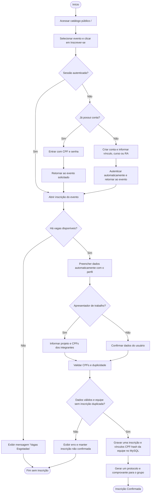
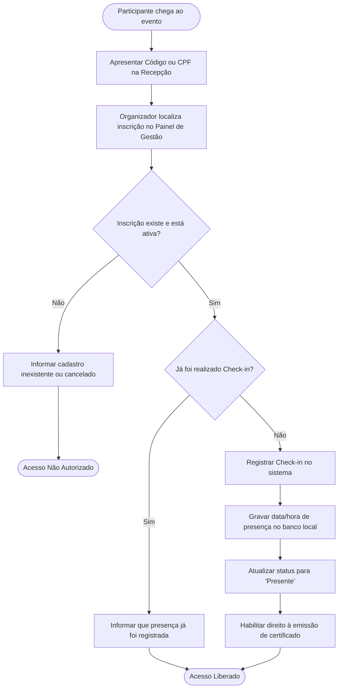

# Diagramas de Atividade (UML) - Módulo Eventos (UNIFACCAMP)

Este documento apresenta os fluxos de processo de negócio modelados como **Diagramas de Atividade UML**, contemplando o caminho feliz (fluxo normal), tomadas de decisão, caminhos alternativos e tratamento de exceções.

---

## 1. Fluxo de Inscrição Online no Evento

Os integrantes não precisam ter conta no momento da inscrição. Quando criarem uma conta com um CPF vinculado, a consulta autenticada localizará a inscrição e a nota homologada do trabalho.

---

## 2. Fluxo de Credenciamento e Check-in de Presença

---

## 3. Fluxo de Emissão e Validação de Certificado Digital

