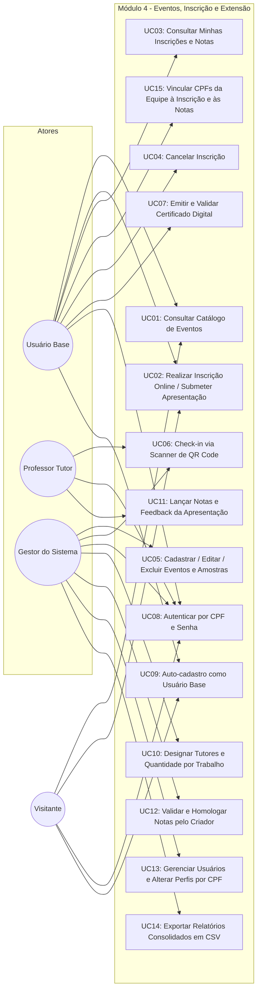

# Diagrama de Casos de Uso - Módulo Eventos (UNIFACCAMP)

## 1. Identificação dos Atores e Perfis de Acesso (RBAC)

| Ator / Perfil | Tipo | Descrição e Papel no Sistema |
| :--- | :--- | :--- |
| **Visitante** | Público | Consulta o catálogo público. Ao iniciar uma inscrição, precisa entrar ou criar uma conta; após autenticação, retorna ao evento solicitado. |
| **Usuário Base (Aluno / Comunidade)** | Acadêmico | Inscreve-se usando os dados do perfil, submete trabalhos e CPFs da equipe para Amostras, consulta inscrições e notas vinculadas ao seu CPF e acessa comprovantes. |
| **Professor Tutor** | Docente Avaliador | Acessa o Portal do Tutor, avalia apresentações de Amostras de alunos atribuídas à sua banca e atribui notas com critérios e parecer técnico. |
| **Gestor do Sistema** | Administrador Geral | Usuário pré-configurado (**CPF 00000000000**). Cria e edita eventos, define quantidade e designa tutores de bancas, valida e homologa notas para divulgação online, e gerencia contas de usuários alterando privilégios a qualquer momento. |
| **Coordenador de Extensão** | Gestão Acadêmica | Acompanha relatórios, estatísticas de ocupação e emissão de certificados. |

---

## 2. Diagrama de Casos de Uso (UML)

---

## 3. Especificação dos Casos de Uso Recentes

### UC01: Consultar Catálogo Público de Eventos
- **Ator Primário:** Visitante ou usuário autenticado.
- **Pré-condições:** Nenhuma.
- **Fluxo Principal:**
  1. O visitante acessa `/` sem precisar entrar no sistema.
  2. Pesquisa eventos por título, tema ou ministrante e filtra por categoria.
  3. Consulta disponibilidade e seleciona "Inscrever-se".
  4. Se não houver sessão, o sistema solicita login ou cadastro e preserva o evento como destino.
  5. Após entrar ou concluir o cadastro, o usuário retorna ao evento para continuar a inscrição.

### UC02: Realizar Inscrição Online / Submeter Apresentação
- **Ator Primário:** Usuário Base; Visitante inicia o fluxo e se autentica antes de continuar.
- **Pré-condições:** Evento com inscrições abertas e vagas disponíveis; sessão autenticada para confirmar.
- **Fluxo Principal:**
  1. O usuário seleciona o evento no catálogo público e inicia a inscrição.
  2. Se necessário, entra ou cria uma conta. O cadastro mantém o evento solicitado como destino.
  3. O sistema preenche a inscrição com nome, CPF, e-mail, telefone, vínculo e curso/RA já salvos no perfil.
  4. O usuário escolhe participação como ouvinte ou apresentador.
  5. Para apresentar trabalho, informa os dados do projeto e os CPFs dos demais integrantes da equipe.
  6. O sistema valida os CPFs e a duplicidade no evento; para cada CPF da equipe, grava um vínculo protegido por hash com a inscrição.
  7. Gera um único protocolo e comprovante para o grupo. A avaliação do trabalho fica vinculada à inscrição compartilhada.
- **Fluxos Alternativos:** CPF inválido ou integrante já inscrito gera aviso e impede a confirmação; evento sem vagas também impede a inscrição.

### UC08: Autenticar por CPF e Senha (Login)
- **Ator Primário:** Qualquer usuário cadastrado (Gestor, Professor Tutor ou Usuário Base).
- **Pré-condições:** Registro prévio no banco de dados MySQL.
- **Fluxo Principal:**
  1. O usuário acessa a rota `/login`.
  2. Informa o CPF (com máscara automática `000.000.000-00`) e a senha de acesso.
  3. O sistema limpa caracteres de pontuação e consulta o hash SHA-256 no banco de dados.
  4. Identificando correspondência, armazena a sessão criptografada com cookie assinado (`eventos_session`).
  5. Se houver evento solicitado antes do login, retorna ao destino preservado; caso contrário, redireciona para o painel correspondente ao perfil:
     - Gestor: `/gestao` ou painel geral
     - Professor Tutor: `/tutor/avaliacoes`
     - Usuário Base: catálogo inicial `/`

### UC09: Auto-cadastro como Usuário Base
- **Ator Primário:** Visitante / Aluno não cadastrado.
- **Fluxo Principal:**
  1. O usuário clica em "Cadastre-se" (`/cadastro`).
  2. Preenche Nome Completo, CPF, E-mail, Telefone, vínculo/categoria, curso ou RA, Senha e Confirmação.
  3. O sistema valida formato e duplicidade de CPF e e-mail.
  4. Salva no MySQL atribuindo **obrigatoriamente o perfil 'Usuário Base'**.
  5. Inicia a sessão automaticamente e, se o cadastro foi iniciado por uma inscrição, retorna ao evento solicitado.

### UC15: Vincular CPFs da Equipe à Inscrição e às Notas
- **Ator Primário:** Usuário Base que submete um trabalho como apresentador.
- **Pré-condições:** Inscrição de apresentação em evento com submissão de trabalhos.
- **Fluxo Principal:**
  1. O apresentador informa os CPFs válidos dos demais integrantes.
  2. O sistema armazena os CPFs como hashes vinculados ao protocolo da inscrição, sem exigir que os integrantes já tenham conta.
  3. Tutores avaliam uma única apresentação e o organizador homologa uma única nota para o trabalho.
  4. Cada integrante que criar uma conta com CPF correspondente passa a localizar a inscrição, a presença do grupo e a nota compartilhada em "Minhas Inscrições".
  5. Depois do cadastro, o integrante também pode se inscrever normalmente em eventos futuros; seus dados cadastrais são reutilizados no formulário.
- **Regra:** O vínculo de CPF compartilha a inscrição e a avaliação do trabalho; não cria inscrições independentes para os integrantes.

### UC10: Designar Tutores e Quantidades pelo Criador
- **Ator Primário:** Gestor / Criador do Evento.
- **Fluxo Principal:**
  1. O gestor acessa o painel de gestão da Amostra (`/gestao/evento/{id}/amostra`).
  2. Define o parâmetro `qtd_tutores_por_trabalho` desejado para a Mostra.
  3. Seleciona professores tutores cadastrados e associa a cada projeto inscrito.
  4. O sistema persiste as bancas na tabela `banca_tutores`.

### UC11: Lançar Notas e Feedback da Apresentação
- **Ator Primário:** Professor Tutor.
- **Fluxo Principal:**
  1. O tutor acessa o *Portal do Tutor* (`/tutor/avaliacoes`).
  2. Visualiza apenas os trabalhos designados à sua banca examinadora.
  3. Clica em "Avaliar Apresentação".
  4. Atribui notas de 1 a 5 para: *Domínio do Tema*, *Clareza da Apresentação* e *Relevância Extensionista*, além de observações/feedback técnico.
  5. O sistema calcula a média e armazena com status "Pendente de Homologação".

### UC12: Validar e Homologar Notas pelo Criador do Evento
- **Ator Primário:** Gestor / Criador do Evento.
- **Fluxo Principal:**
  1. O criador do evento revisa as médias preliminares atribuídas pelos tutores.
  2. Clica em "Homologar Notas" (individual ou em lote para toda a Amostra).
  3. O sistema oficializa a `nota_final` e altera a flag `notas_homologadas = 1`.
  4. As notas e pareceres passam a estar disponíveis na área do aluno (`/minhas-inscricoes`).

### UC13: Gerenciar Usuários e Alterar Perfis por CPF
- **Ator Primário:** Gestor do Sistema.
- **Fluxo Principal:**
  1. O gestor acessa o painel `/gestao/usuarios`.
  2. Pesquisa o usuário por CPF ou nome.
  3. Na listagem, seleciona o novo papel desejado no dropdown:
     - `Usuário Base`, `Professor Tutor`, `Gestor` ou `Coordenador`.
  4. Ao selecionar `Professor Tutor`, o sistema sincroniza os dados do docente automaticamente na tabela `tutores` para composição de bancas.
  5. Confirma a alteração e atualiza as permissões instantaneamente.

### UC06: Check-in via Scanner de QR Code
- **Ator Primário:** Professor Tutor / Gestor.
- **Fluxo Principal:**
  1. O organizador abre a tela do scanner (`/scanner`) no celular ou notebook.
  2. Aponta a câmera para o QR Code do comprovante de inscrição do aluno.
  3. A biblioteca cliente (`html5-qrcode`) decodifica o código e dispara `POST /api/checkin/qr`.
  4. O sistema busca os dados do participante, registra a data/hora da presença e confirma o credenciamento instantâneo.
