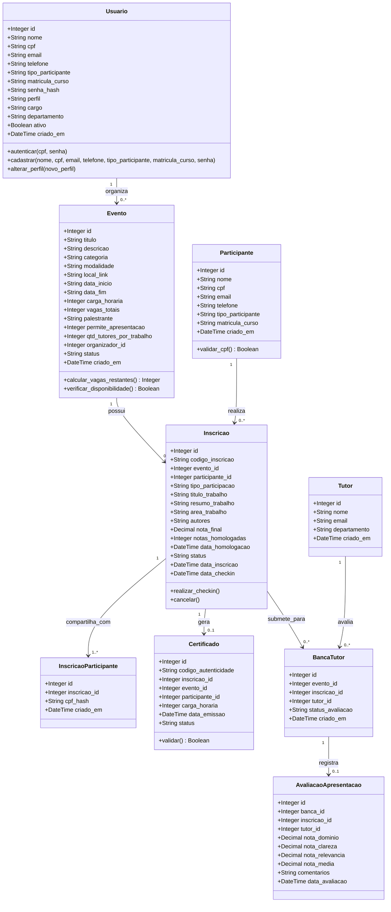
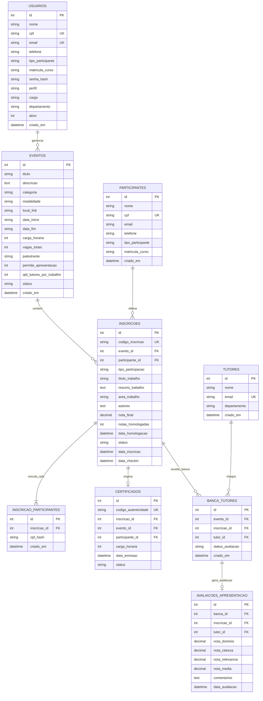

# Modelagem de Dados: Diagrama MER e Classes (UML)

Este documento descreve as entidades de negócio, seus atributos, cardinalidades, perfis e métodos de manipulação implementados no banco de dados relacional MySQL 8.0 do projeto **Eventos** (Módulo 4 da UNIFACCAMP).

---

## 1. Diagrama de Classes e Entidades (UML)

---

## 2. Diagrama de Relacionamento de Entidades (MER / DER)

---

## 3. Dicionário de Dados Oficial

### Tabela: `usuarios`
Responsável pela segurança, controle de acesso e permissões (RBAC).

| Campo | Tipo | Nulo | Chave | Descrição e Regras |
| :--- | :--- | :---: | :---: | :--- |
| `id` | INT AUTO_INCREMENT | Não | PK | Identificador numérico primário. |
| `nome` | VARCHAR(255) | Não | - | Nome completo do usuário. |
| `cpf` | VARCHAR(20) | Não | UK | CPF único utilizado para login (formatado ou limpo). |
| `email` | VARCHAR(255) | Não | UK | Endereço eletrônico institucional/pessoal. |
| `telefone` | VARCHAR(50) | Sim | - | Contato telefônico / WhatsApp. |
| `tipo_participante` | VARCHAR(100) | Sim | - | Vínculo/categoria informada no cadastro e reutilizada na inscrição. |
| `matricula_curso` | VARCHAR(150) | Sim | - | Curso, RA ou matrícula reutilizados na inscrição. |
| `senha_hash` | VARCHAR(255) | Não | - | Hash criptográfico SHA-256 da senha. |
| `perfil` | VARCHAR(50) | Não | - | Papel no sistema: **Gestor**, **Professor Tutor**, **Usuário Base**, **Coordenador**. |
| `cargo` | VARCHAR(100) | Sim | - | Título profissional ou acadêmico. |
| `departamento`| VARCHAR(150) | Sim | - | Setor, curso ou pró-reitoria. |
| `ativo` | TINYINT(1) | Não | - | Indicador de usuário ativo (1) ou bloqueado (0). |
| `criado_em` | DATETIME | Não | - | Carimbo de data/hora do cadastro. |

> **Nota de Negócio (RBAC):**
> 1. O usuário **Gestor Geral** é pré-configurado no banco de dados com CPF `00000000000`.
> 2. Todo novo usuário registrado inicia obrigatoriamente com perfil **Usuário Base**.
> 3. O Gestor pode alterar o perfil para **Professor Tutor** a qualquer momento, momento em que o sistema cadastra o usuário automaticamente na tabela `tutores` para permitir composição de bancas examinadoras.

### Tabela: `inscricao_participantes`
Relaciona os CPFs dos integrantes a uma inscrição, permitindo uma única apresentação e nota compartilhada sem exigir que cada integrante já possua conta.

| Campo | Tipo | Nulo | Chave | Descrição e Regras |
| :--- | :--- | :---: | :---: | :--- |
| `id` | INT AUTO_INCREMENT | Não | PK | Identificador do vínculo. |
| `inscricao_id` | INT | Não | FK | Inscrição do grupo; removido em cascata com a inscrição. |
| `cpf_hash` | VARCHAR(64) | Não | UK composta | Blind index HMAC-SHA256 do CPF; permite localizar inscrição e nota sem duplicar o trabalho. |
| `criado_em` | DATETIME | Não | - | Data/hora em que o CPF foi vinculado. |

> **Regra de consulta:** Quando um integrante cria uma conta com o mesmo CPF, a consulta de inscrições autenticada localiza o vínculo e apresenta a nota homologada daquela inscrição.
