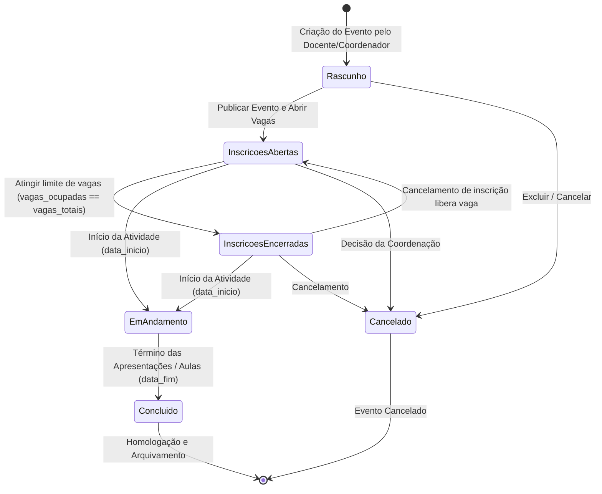

# Diagramas de Estados (UML) - Módulo Eventos (UNIFACCAMP)

Este documento contempla a máquina de estados finitos e as transições do ciclo de vida das duas principais entidades mutáveis do sistema: **Evento** e **Inscrição**.

---

## 1. Ciclo de Vida do Evento / Curso

### Regras de Transição de Estado do Evento
- **Rascunho -> Inscrições Abertas:** Permite aos participantes visualizarem o evento no catálogo público e efetuarem inscrições online.
- **Inscrições Abertas -> Inscrições Encerradas:** Disparado automaticamente quando a contagem de inscritos confirmados atinge a capacidade máxima de `vagas_totais`.
- **Inscrições Encerradas -> Inscrições Abertas:** Se uma vaga for liberada por cancelamento de inscrição, o sistema reabre as inscrições automaticamente.
- **Em Andamento -> Concluído:** Atingida a data final, o evento é encerrado e a emissão em lote de certificados é disponibilizada para os presentes.

---

## 2. Ciclo de Vida da Inscrição do Participante

```mermaid
stateDiagram-v2
    [*] --> Confirmada : Inscrição autenticada realizada; CPFs da equipe vinculados quando houver
    
    Confirmada --> Presente : Check-in realizado no dia do evento (Credenciamento)
    Confirmada --> Cancelada : Solicitação de desistência pelo participante/gestor
    Confirmada --> Ausente : Evento concluído sem registro de check-in
    
    Presente --> CertificadoEmitido : Solicitação de emissão do certificado com autenticidade
    
    CertificadoEmitido --> [*] : Certificado permanente validado no sistema
    Cancelada --> [*] : Vaga devolvida ao evento
    Ausente --> [*] : Sem direito à certificação
```

### Regras de Transição de Estado da Inscrição
- **Confirmada:** A vaga do participante está reservada e garantida no banco de dados. Um código identificador `INS-2026-XXXX` é gerado.
- **Inscrição em grupo:** A apresentação continua sendo uma única inscrição; os CPFs adicionais são vínculos de consulta, não inscrições individuais nem estados separados.
- **Presente:** Registrado pelo organizador através do botão de credenciamento. Armazena timestamp em `data_checkin`.
- **Certificado Emitido:** Apenas participantes com estado **Presente** podem transitar para a emissão do certificado `CERT-2026-XXXXX`.
- **Cancelada:** A vaga ocupada é deduzida da contagem do evento, permitindo que outros interessados se inscrevam.

### Avaliação e Consulta por CPF
- A homologação atualiza a nota da inscrição e não altera o estado de presença ou emite certificado.
- Todos os CPFs vinculados a uma apresentação consultam a mesma nota homologada após autenticação. O vínculo pode existir antes do cadastro da conta.
- O catálogo (`GET /`) é público; a inscrição continua condicionada a login ou cadastro e retorna ao evento solicitado após autenticação.
